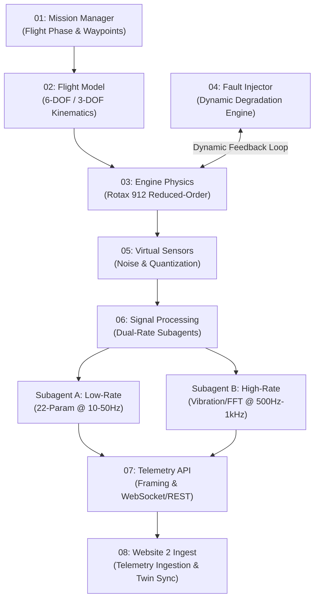

# Bharat-AeroTwin: Project Mission & Agent Architecture

> **Google Antigravity Agent-First Architecture Brief**  
> **System Target**: Reduced-Order Digital Twin & High-Fidelity UAV Flight + Engine Simulation (Rotax 912)  
> **Core Methodology**: Discrete, independently verifiable missions with strict I/O contracts and deterministic artifact verification.

---

## 1. Architectural Philosophy

Antigravity operates through **missions**, **agents**, and **verifiable artifacts**. Rather than maintaining an opaque monolithic pipeline, the digital twin is organized into a modular **Mission Graph**:

---

## 2. Mission Directory Specifications

| Mission Directory | Primary Responsibility | Input Contract | Output Contract | Verification Artifact |
| :--- | :--- | :--- | :--- | :--- |
| **`missions/01-mission-manager`** | Waypoint navigation, mission phase FSM, climb/cruise/descent schedule | Mission config, target coordinates, geofence bounds | Waypoint targets, target airspeed/altitude, commanded throttle | Phase FSM transition log & geofence compliance report |
| **`missions/02-flight-model`** | 6-DOF / 3-DOF kinematics, aerodynamic lift/drag, wind envelope | Commanded flight commands, ambient atmosphere, thrust | Aircraft position $(x, y, z)$, velocity vector, attitude $(\phi, \theta, \psi)$ | Trajectory plot vs. `nominal_flight_baseline.csv` ($< 1\%$ RMSE) |
| **`missions/03-engine-physics`** | Rotax 912 reduced-order model (RPM, CHT, EGT, Oil, Fuel Flow) | Throttle, airspeed, altitude, fault modifiers | True physical engine states (temperatures, pressures, power) | Physics bounds assert artifact ($\text{RPM} \in [0, 5800]$, $\text{EGT} < 950^\circ\text{C}$) |
| **`missions/04-fault-injector`** | Progressive degradation & fault state evolution | Injected fault command, current engine state, elapsed time | Feedback modifiers (friction torque, thermal resistance, fuel bias) | Time-series state deviation & fault confusion matrix |
| **`missions/05-virtual-sensors`** | Sensor noise models, quantization, calibration drift, latency | True engine & flight physical states | Raw sensor readings with synthetic noise | Signal-to-Noise Ratio (SNR) and Allan deviation report |
| **`missions/06-signal-processing`** | Dual-rate feature extraction (Low-rate 22-param + High-rate vibration) | Raw sensor streams | Low-rate filtered stream + High-rate RMS/Crest/FFT spectral bands | Dual-rate sampling contract & FFT harmonic peak report |
| **`missions/07-telemetry-api`** | Payload packaging, CRC/HMAC framing, batching, WebSocket/REST client | Filtered telemetry & vibration feature packets | Serialized transmission stream | Schema-compliance artifact & socket throughput benchmark |
| **`missions/08-website2-ingest`** | Downstream ingest adapter, twin synchronization, replay harness | Telemetry network packets | Validated ingest events & twin state updates | Replay verification against mock ingestion endpoint |

---

## 3. Critical Architectural Directives

### Directives on Fault Evolution (Feedback Edge)
Faults must **NOT** merely be additive sensor corruptions applied downstream. The Fault Injector (`04-fault-injector`) maintains a dynamic feedback loop into Engine Physics (`03-engine-physics`), where faults evolve over time (e.g., bearing raceway degradation progressively worsens friction torque, causing RPM jitter and temperature escalation).

### Directives on Dual-Rate Signal Processing
Signal Processing (`06-signal-processing`) is strictly partitioned into two subagent tasks:
1. **Low-Rate Processor**: Handles the standard 22-parameter flight/engine stream at $10\text{--}50\text{ Hz}$ with rolling-window statistics, outlier rejection, and capability margin scoring.
2. **High-Rate Vibration Processor**: Handles the high-bandwidth accelerometer/acoustic stream at $500\text{ Hz}\text{--}1\text{ kHz}$, performing time-domain extraction ($\text{RMS}$, Peak-to-Peak, Crest Factor) and FFT spectrum calculation across $1\times, 2\times$, and bearing fault pass frequencies.

---

## 4. Verification Standards for Agents

Every agent modifying or adding code to a mission MUST execute the mission's verification runner and ensure all artifacts are written to `brain/<conversation-id>/` or `tests/artifacts/`.
No pull request or mission completion is valid without reproducible verification artifacts.
